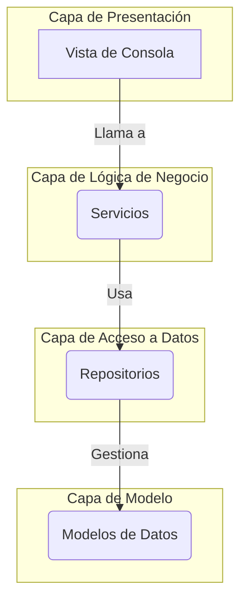

# Tarea: Tarjeta de Fidelidad Gamificada

Programa de línea de comandos en Java que simula un sistema de fidelización de clientes, aplicando TDD, diseño orientado a objetos y cálculo de puntos por compras.

---

## 1. Diseño de la Aplicación

La tarea sigue una arquitectura por capas para separar responsabilidades y facilitar el testeo y mantenimiento.

-   **`modelo`**: Contiene las entidades de datos (`Cliente`, `Compra`, `Nivel`).
-   **`repositorio`**: Capa de acceso a datos. Abstrae la lógica de persistencia (en este caso, en memoria).
-   **`servicio`**: Contiene toda la lógica de negocio (cálculos, validaciones, reglas). Es el cerebro de la aplicación.
-   **`vista`**: Responsable de la interacción con el usuario a través de la consola.
-   **`Main.java`**: Punto de entrada que ensambla e inicia la aplicación.

### Diagrama de Componentes (Mermaid)


---

## 2. Instrucciones de Uso

### Requisitos
- Java JDK 21+
- Apache Maven 3.6+

### Compilar la Tarea
Para compilar el código fuente y empaquetar la aplicación, ejecuta el siguiente comando en la raíz de la tarea:
```bash
mvn clean install
```

### Ejecutar las Pruebas Unitarias
Para verificar el correcto funcionamiento de la lógica de negocio, ejecuta:
```bash
mvn test
```

#### Ejemplo de Salida de Tests
```
[INFO] -------------------------------------------------------
[INFO]  T E S T S
[INFO] -------------------------------------------------------
[INFO] Running cl.usm.fidelidad.servicio.CompraServicioTest
[INFO] Tests run: 8, Failures: 0, Errors: 0, Skipped: 0
[INFO] Running cl.usm.fidelidad.servicio.ClienteServicioTest
[INFO] Tests run: 6, Failures: 0, Errors: 0, Skipped: 0
[INFO]
[INFO] Results:
[INFO]
[INFO] Tests run: 14, Failures: 0, Errors: 0, Skipped: 0
[INFO]
[INFO] ------------------------------------------------------------------------
[INFO] BUILD SUCCESS
[INFO] ------------------------------------------------------------------------
```

### Ejecutar la Aplicación
Una vez compilado, puedes iniciar el programa con:
```bash
java -jar target/proyecto-tarjeta-fidelidad-1.0-SNAPSHOT-jar-with-dependencies.jar
```

---

## 3. Cobertura de Pruebas

### ¿Qué tipo de cobertura he medido y por qué?

Para esta tarea, he medido la **cobertura de líneas (Line Coverage)** y la **cobertura de métodos (Method Coverage)** utilizando la herramienta EclEmma, que se integra con JaCoCo en el IDE de Eclipse.

Elegí medir estas métricas por las siguientes razones:

1.  **Validación de la Lógica de Negocio:** El objetivo principal de las pruebas en esta tarea es asegurar que la lógica de negocio (cálculo de puntos, cambio de niveles, bonos, etc.), ubicada en la **capa de servicio**, funcione como se espera. La cobertura de líneas me permite verificar visualmente que cada sentencia condicional (`if/else`) y cada cálculo han sido ejecutados al menos una vez por los tests, lo que me da una alta confianza en su correctitud.

2.  **Guía para el TDD:** El reporte de cobertura fue una herramienta fundamental durante el desarrollo. Las líneas marcadas en rojo o amarillo me indicaron de forma inmediata qué casos de prueba me faltaban por escribir, permitiéndome crear tests específicos para esos escenarios y así asegurar que no quedaran caminos lógicos sin probar.

3.  **Enfoque Pragmático:** Me enfoqué en obtener una cobertura cercana al 100% en las clases de la capa de **servicio**, ya que son las más críticas y complejas. Acepté una cobertura menor en las clases del **modelo** (POJOs) y del **vista** (consola), ya que probar unitariamente sus setters o la interacción con `System.out` aporta un valor marginal y no era el foco del TDD para esta tarea. La cobertura, por tanto, se usó como un mapa para guiar el esfuerzo de testing hacia las áreas de mayor riesgo y complejidad.

---

## 4. Licencia

Esta tarea está distribuido bajo la **Licencia MIT**. Puedes ver el detalle completo en el archivo [LICENSE](LICENSE) de este repositorio.